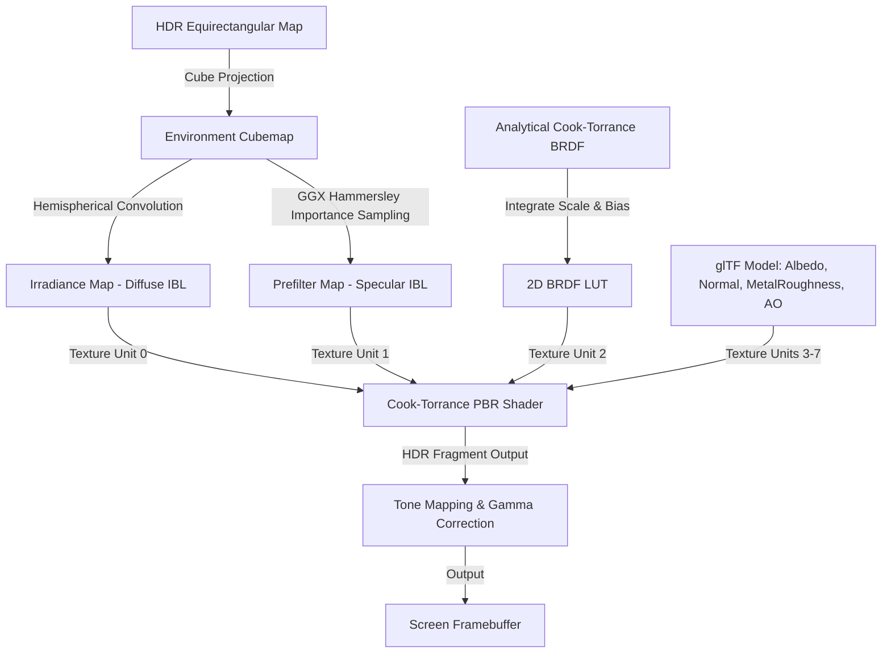
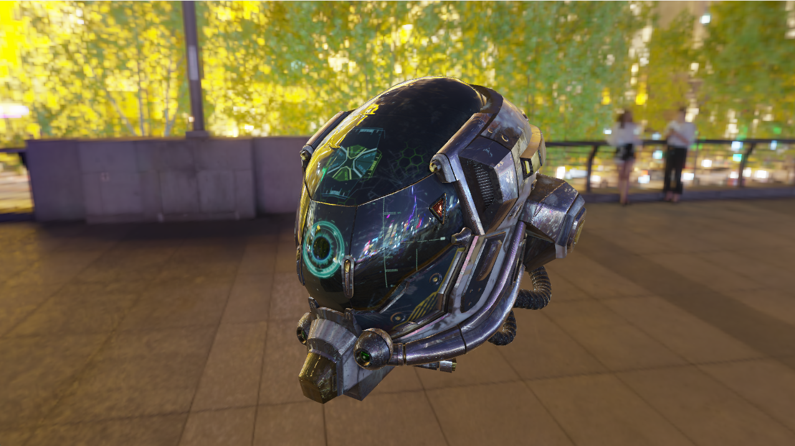
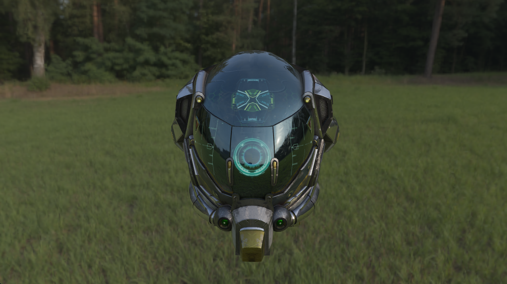
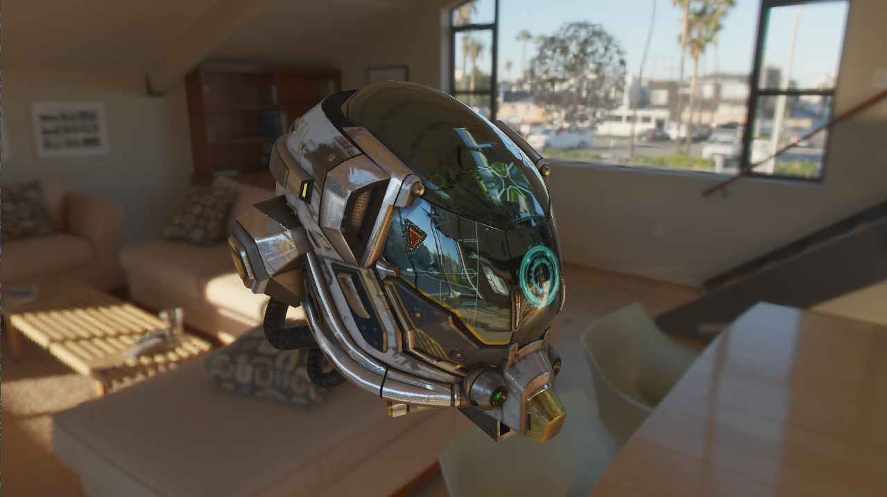

# IBL PBR Renderer

I built this OpenGL C++ renderer to figure out how Physically Based Rendering and Image-Based Lighting actually work under the hood. It implements the standard Cook-Torrance microfacet BRDF, and because doing the full hemisphere integral for environment reflections is obviously way too slow for real-time rendering, I implemented the split-sum approximation to pre-compute the lighting data. This splits the specular integral into two parts: a prefiltered environment map for the radiance and a 2D BRDF lookup table (LUT) that integrates the scale and bias.

Huge shoutout to [LearnOpenGL](https://learnopengl.com/) by the way—I used their tutorials a ton for reference, and a good chunk of the actual PBR/IBL implementation here is heavily based on their code.

For the prefiltering step, the engine uses Hammersley importance sampling to generate uniform 2D samples, mapping them via the GGX inverse CDF to yield rays that are heavily biased toward the specular lobe. These samples are then convolved and stored across the cubemap's mip levels corresponding to different roughness values.

Data flow wise, here's roughly how the engine separates the pre-computation from the main render loop to keep things fast:

### General Info

It supports glTF 2.0 loading via Assimp, and the shader expects the standard glTF packed metal-roughness textures where roughness is in the green channel and metalness is in the blue channel. You can swap the HDR environments dynamically at runtime by pressing `1`, `2`, or `3` to switch between Shanghai Bund (high contrast specular), Newport Loft (soft studio lighting), and Lilienstein (vibrant outdoor diffuse).

  
  
  

### Building

It uses GLFW3 for windowing, GLAD for OpenGL pointers, GLM for math, and Assimp for the models. If you're on Windows, just open `EVC.sln` in Visual Studio 2022 or newer, set the configuration to x64 Release, and build it. The post-build events should handle copying the required DLLs over to the output directory so `x64/Release/EVC.exe` runs without complaining about missing dependencies.

### What's Next

Right now it's just a forward renderer, but eventually I want to add a proper UI (probably Dear ImGui) to tweak material properties and camera parameters on the fly, and I'll likely add some post-processing like SSAO or bloom down the line to ground the models better. Cascaded shadow maps would be nice too, since outdoor environments look a bit flat without proper directional shadows.

### License

This project is licensed under the MIT License - see the [LICENSE](LICENSE) file for details.
